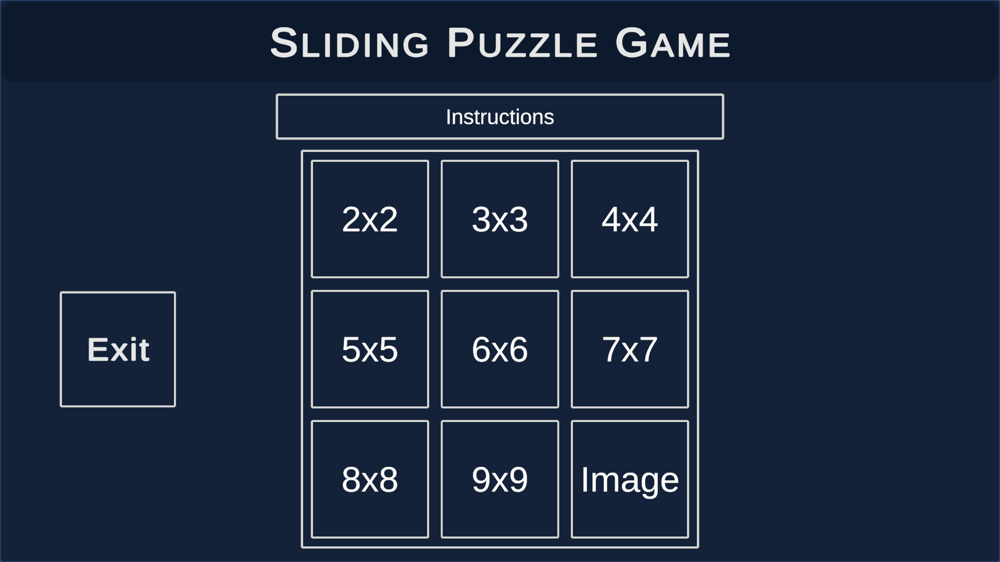
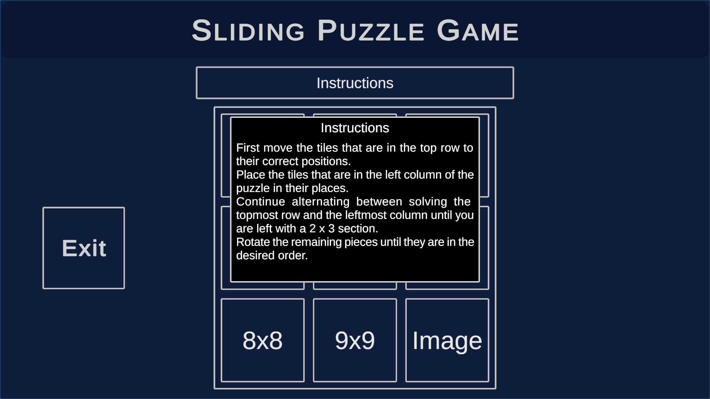
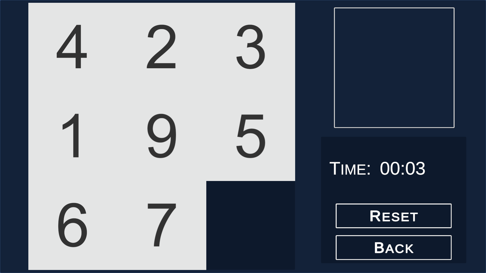
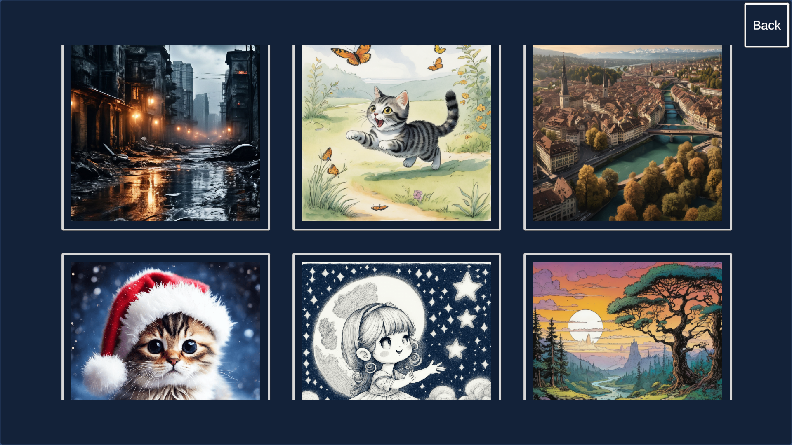
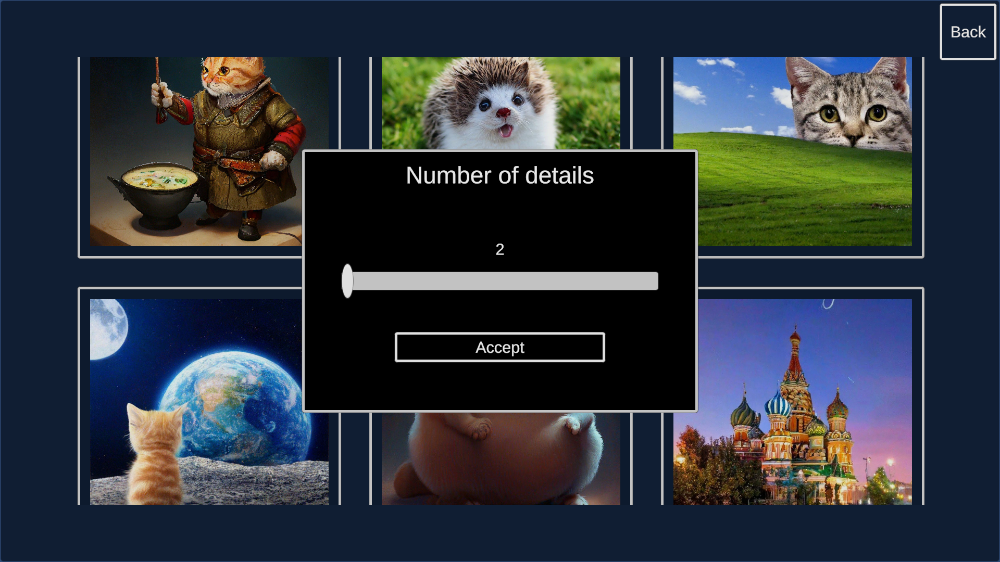
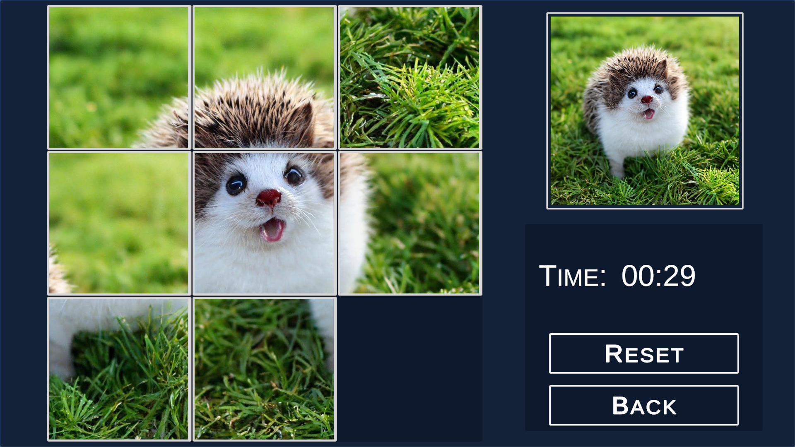
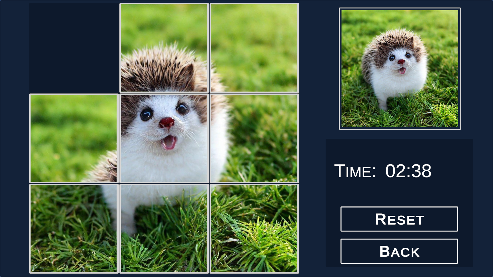

# Sliding Puzzle

Eng | [Rus](resources/localization_readme/README_RU.md)

## Description

A sliding puzzle, also known as a puzzle with sliding blocks or sliding tiles, is a combined puzzle in which the player is offered to move parts along certain routes (usually on a board) to set a certain final configuration.

The game has two modes, in the first mode, the player is offered a puzzle of tiles with numbers that need to be assembled in order of increasing, in the second mode, the player is offered a puzzle of parts of the image that need to be assembled into an image.

There are different levels of difficulty in the game, from 2x2 to 9x9.

## Download

You can download the PC version on the [releases](https://github.com/ShutovKS/SlidingPuzzle/releases) page.

The web version is available on [itch.io](https://shutovks.itch.io/sliding-puzzle).

The Android version is available on [Google Play](https://play.google.com/store/apps/details?id=com.Forgeofgameworlds.SlidingPuzzle) and [apk release format](https://github.com/ShutovKS/SlidingPuzzle/releases).

## Information

### Author and developer

- Shutov Kirill (ShutovKS), Russia

#### Links

- [My VK page](https://vk.com/shutovks)
- [My Telegram page](https://t.me/shutovks)
- [Play Market](https://play.google.com/store/apps/developer?id=Forge+of+game+worlds)
- [Itch.io](https://shutovks.itch.io/)
- [GitHub](https://github.com/ShutovKS)

### License

``` text
MIT License
```

## Screenshots
















